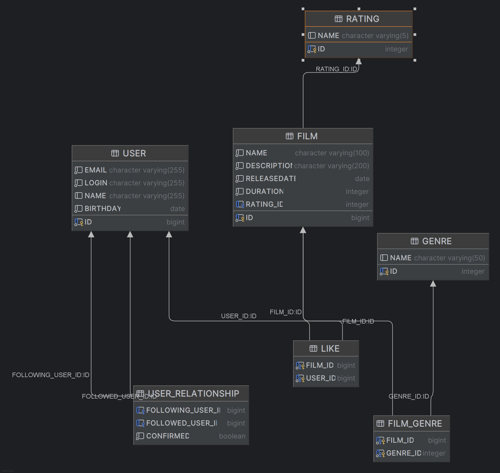

# java-filmorate

)

## Таблица "user" хранит пользователей системы
### id (long) - идентификатор пользователя системы
### email (varchar) - адрес электронной почты пользователя  
### login (varchar) - логин пользователя
### name (varchar) - имя пользователя
### birthday (date) - дата рождения пользователя

#### Пример запроса на получение всех пользователей
```sql
SELECT ID, EMAIL, LOGIN, NAME, BIRTHDAY
FROM "USER";
```

## Таблица "film" хранит фильмы системы
### id (long) - идентификатор фильма системы
### name (varchar) - название фильма 
### description (varchar) - описание фильма (макс. 200 символов)
### releaseDate (date) - дата выхода фильма
### duration (interval) - длительность фильма
### rating_id (integer) - идентификатор рейтинга Ассоциации кинокомпаний

#### Пример запроса на получение всех фильмов
```sql
SELECT FILM.*, RATING.NAME AS RATING_NAME FROM FILM
LEFT JOIN RATING ON FILM.RATING_ID = RATING.ID;
```

## Таблица "FILM_GENRE" хранит жанры фильмов
### film_id (long) - идентификатор фильма системы
### genre_id (integer) - идентификатор жанра

#### Пример запроса на получение жанров фильма
```sql
SELECT G.* FROM GENRE G
INNER JOIN FILM_GENRE F ON G.ID = F.GENRE_ID WHERE F.FILM_ID = ?;
```

## Таблица "genre" хранит жанры
### id (integer) - идентификатор жанра
### name (varchar) - имя жанра

#### Пример запроса на получение жанров
```sql
SELECT * 
FROM GENRE;
```

## Таблица "rating" хранит рейтинги
### id (integer) - идентификатор рейтинга
### name (varchar) - имя рейтинга

#### Пример запроса на получение рейтингов
```sql
SELECT * 
FROM RATING;
```

## Таблица "user_relationship" хранит отношения пользователей
### following_use_id (long) - идентификатор подписавшегося пользователя
### followed_use_id (long) - идентификатор пользователя, на которого подписались
### confirmed (boolean) - статус одобрения заявки

#### Пример запроса на получение друзей пользователя
```sql
SELECT ID, EMAIL, LOGIN, NAME, BIRTHDAY FROM "USER"
WHERE ID IN (SELECT FOLLOWING_USER_ID FRIEND_ID FROM USER_RELATIONSHIP
WHERE FOLLOWED_USER_ID = ?
UNION
SELECT FOLLOWED_USER_ID FRIEND_ID FROM USER_RELATIONSHIP
WHERE FOLLOWING_USER_ID = ? AND CONFIRMED);
```