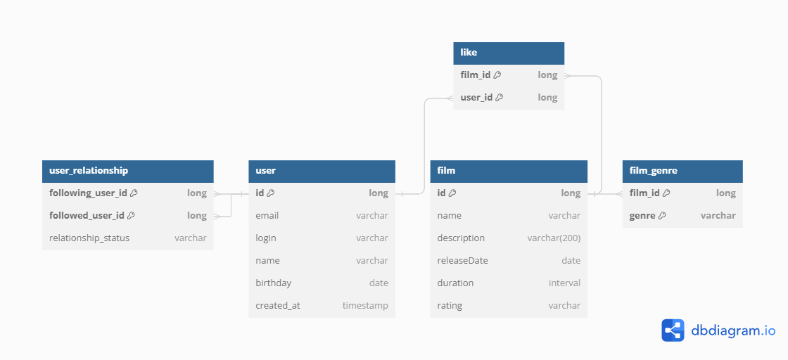

# java-filmorate



## Таблица "user" хранит пользователей системы
### id (long) - идентификатор пользователя системы
### email (varchar) - адрес электронной почты пользователя  
### login (varchar) - логин пользователя
### name (varchar) - имя пользователя
### birthday (date) - дата рождения пользователя

#### Пример запроса на получение всех пользователей
```sql
SELECT * 
FROM user;
```

## Таблица "film" хранит фильмы системы
### id (long) - идентификатор фильма системы
### name (varchar) - название фильма 
### description (varchar) - описание фильма (макс. 200 символов)
### releaseDate (date) - дата выхода фильма
### duration (interval) - длительность фильма
### rating (varchar) - рейтинг Ассоциации кинокомпаний

#### Пример запроса на получение всех фильмов
```sql
SELECT * 
FROM film;
```
